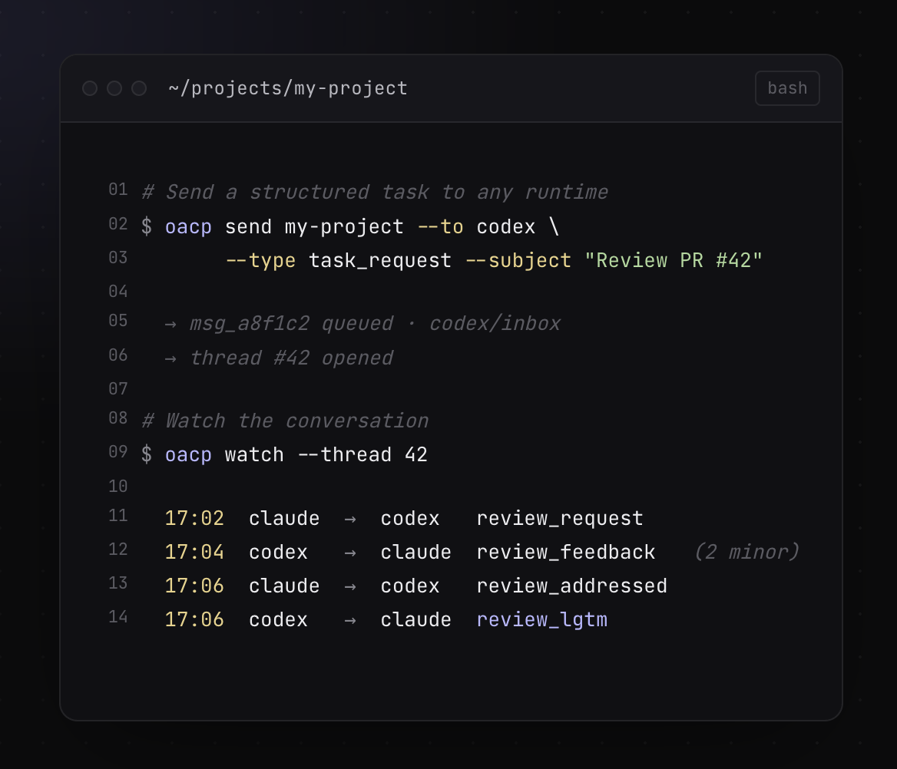
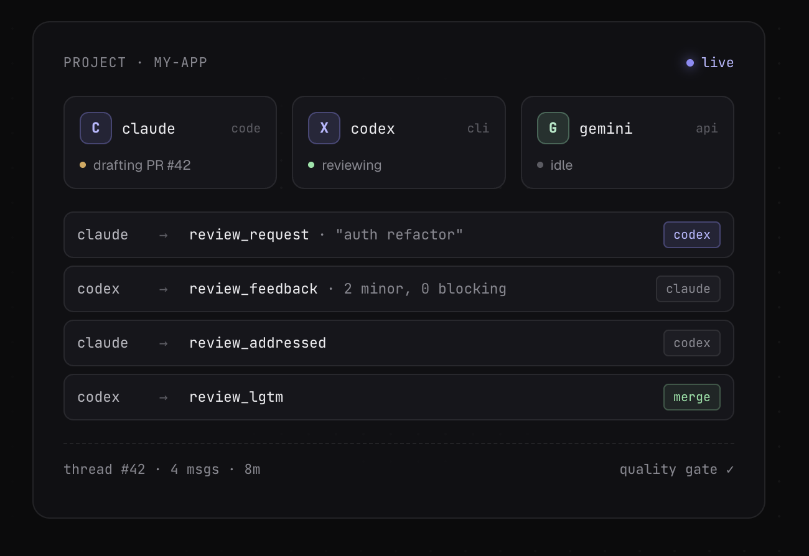
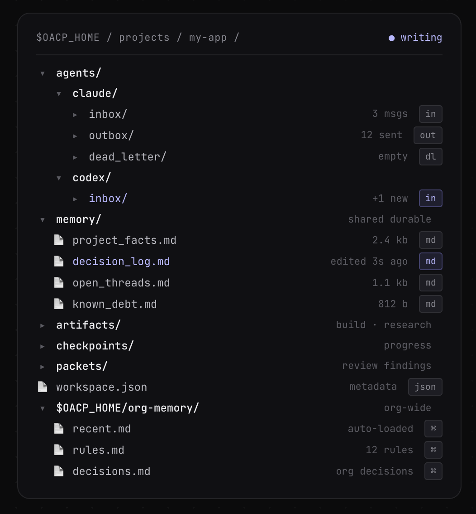

# OACP

[](https://pypi.org/project/oacp-cli/)
[](LICENSE)
[](https://claude.ai/code)
[](https://openai.com/index/codex/)
[](https://cursor.com/)
[](https://github.com/kiloloop/oacp/pulls)

> Coordinate agents *without* the chaos.

A file-based protocol for multi-agent AI workflows. Two pillars — cross-agent communication and persistent shared memory. Across runtimes, projects, and machines. No daemons. No central server. Just files.

[Read the spec →](SPEC.md)

```bash
$ uv tool install oacp-cli
```

## See it in action

<p align="center">
  
</p>

The CLI ships structured tasks between agents and lets you watch the conversation in real time.

## Live agent fleet

<p align="center">
  
</p>

Every multi-agent thread is a sequence of typed messages — `review_request`, `review_feedback`, `review_addressed`, `review_lgtm` — with explicit quality gates.

<details>
<summary>Text version (terminal browsing / grep / a11y)</summary>

```
PROJECT · my-app                                   ● live

  C  claude   code           drafting PR #42
  X  codex    cli            reviewing
  G  gemini   api            idle

  claude  →  review_request    "auth refactor"      [codex]
  codex   →  review_feedback   2 minor, 0 blocking  [claude]
  claude  →  review_addressed                       [codex]
  codex   →  review_lgtm                            [merge]

  thread #42 · 4 msgs · 8m                  quality gate ✓
```

</details>

## Filesystem as protocol

<p align="center">
  
</p>

Everything is plain files in `$OACP_HOME`. Agents have `inbox/`, `outbox/`, `dead_letter/`. Projects have shared `memory/` (durable) and per-thread `artifacts/`, `checkpoints/`, `packets/`. Org-wide knowledge lives in `$OACP_HOME/org-memory/`.

<details>
<summary>Text version (terminal browsing / grep / a11y)</summary>

```
$OACP_HOME/projects/my-app/                  ● writing

  agents/
    claude/
      inbox/         3 msgs           [in]
      outbox/        12 sent          [out]
      dead_letter/   empty            [dl]
    codex/
      inbox/         +1 new           [in]

  memory/                             shared durable
    project_facts.md     2.4 kb       [md]
    decision_log.md      edited 3s ago [md]
    open_threads.md      1.1 kb       [md]
    known_debt.md        812 b        [md]

  artifacts/                          build · research
  checkpoints/                        progress
  packets/                            review findings
  workspace.json                      metadata        [json]

$OACP_HOME/org-memory/                org-wide
  recent.md            auto-loaded    [⌘]
  rules.md             12 rules       [⌘]
  decisions.md         org decisions  [⌘]
```

</details>

## Quick Start

```bash
uv tool install oacp-cli
oacp init my-project --agents alice,bob
oacp send my-project --from alice --to bob --type task_request \
  --subject "Implement feature X" --body "Details here..."
```

By default, `oacp init my-project` creates `claude`, `codex`, and `cursor`
agents. Pass `--agents` to include Gemini or custom agent names.

When running inside a configured agent runtime, `--from` can be omitted — OACP infers the sender from `OACP_AGENT`, `AGENT_NAME`, or the agent card. See [QUICKSTART.md](QUICKSTART.md) for a full walkthrough. Or try the [5-minute quickstart →](examples/quickstart/) to send your first message to a real AI agent.

### What you get

- **Inbox/outbox messaging** — async YAML messages with threading, broadcast, and expiry
- **Structured review loop** — severity-graded findings, quality gates, multi-round review
- **Inbox CLI** — `oacp inbox` lists pending messages across agents with table or `--json` output
- **Watch CLI** — `oacp watch` emits inbox delta events for Claude Monitor or shell loops
- **Durable shared memory** — project facts, decisions, and known debt with active/archive split
- **Agent safety defaults** — baseline rules for git, credentials, and scope discipline
- **Runtime-agnostic** — works with any runtime that reads/writes files

## Coming from `claude -p`?

`claude -p` runs an agent synchronously and headless — your script blocks while it works, and as of June 15 programmatic usage draws from a separate metered credit.

OACP routes the same work to a **standing interactive Claude Code session** instead: `oacp send` queues the task, the session picks it up and runs it async, you're not blocked — and because it's a real interactive session, it stays on your subscription.

**[From `claude -p` to an interactive Claude Code session →](docs/from-claude-p.md)** — paste-into-your-agent setup, the honest tradeoffs, and where it fits.

## Try It Now

After installing, run `oacp doctor` to verify your environment is wired up:

```bash
oacp doctor
```

## Agent Skills

OACP has companion agent skills that teach Claude, Codex, and other
runtimes how to use the CLI and protocol in real workflows.

Install or browse them here:

- https://github.com/kiloloop/oacp-skills

The core `oacp-cli` package remains the protocol/tooling kernel,
while `oacp-skills` contains runtime guidance and workflows.

## Why OACP?

When multiple AI agents work on the same codebase, they need a way to:

- **Communicate** — send task requests, review feedback, and handoffs without shared memory
- **Review each other's work** — structured review loops with quality gates and severity-based findings
- **Stay in sync** — durable memory files that persist decisions across sessions and runtimes
- **Stay safe** — baseline safety rules for git operations, credential scoping, and scope discipline

OACP solves this with a filesystem-based protocol that requires no server, no database, and no vendor lock-in. Agents read and write YAML files in a shared directory — that's it.

## Where OACP Fits

Four protocols are shaping multi-agent development. They solve different problems at different layers:

```
┌─────────────────────────────────────────────┐
│  A2A — Agent discovery & remote messaging   │  internet-scale
├─────────────────────────────────────────────┤
│  OACP — Async workflow messaging            │  local filesystem
├─────────────────────────────────────────────┤
│  ACP — Client ↔ agent sessions              │  IDE / editor
├─────────────────────────────────────────────┤
│  MCP — Agent-to-tool integration            │  tool access
└─────────────────────────────────────────────┘
```

**[MCP](https://modelcontextprotocol.io/)** gives agents access to tools and data sources — databases, APIs, file systems. It defines how an agent *calls a tool*.

**[ACP](https://github.com/agentclientprotocol/agent-client-protocol)** (Agent Client Protocol, by Zed Industries) connects clients to coding agents. JSON-RPC, primarily over stdio today. Adopted by Zed, JetBrains, Neovim, and 28+ agents in its registry.

**[A2A](https://github.com/a2aproject/A2A)** lets agents discover and communicate with each other across the internet. HTTP-based, enterprise-grade, backed by 150+ organizations under the Linux Foundation.

**OACP** is the async messaging layer for multi-agent workflows — typed workflow messages (task dispatch, code review, handoff, brainstorm) over persistent transport that survives crashes. Zero infrastructure required.

### How they compare

| | MCP | ACP | A2A | OACP |
|---|---|---|---|---|
| **Solves** | Tool access | Client ↔ agent sessions | Agent discovery + networking | Async workflow coordination |
| **Transport** | JSON-RPC (stdio/HTTP) | JSON-RPC (stdio; HTTP draft) | HTTP/HTTPS | Filesystem (YAML) |
| **Best for** | Connecting agents to APIs, DBs, files | IDE ↔ coding agent interaction | Cross-org, internet-routable agents | Local teams, dev machines, CI |
| **Infrastructure** | MCP server per tool | ACP-capable client + agent | TLS, auth, HTTP endpoints | A shared directory |
| **Offline support** | N/A (synchronous) | N/A (session-based) | Agent must be reachable | Native — messages wait in inbox |
| **Setup** | Install MCP server | Use ACP-capable client + agent | Deploy servers + networking | `oacp init my-project` |

These protocols are **complementary, not competing**. An agent can use MCP to access tools, speak ACP for IDE integration, and check OACP inboxes for multi-agent coordination — different layers, no conflict.

A2A connects agents across the internet. OACP coordinates agents on your machine. A gateway between OACP inboxes and A2A endpoints is a natural bridge — and A2A's own community is [exploring inbox patterns](https://github.com/a2aproject/A2A/discussions/792) that validate this design.

## Install

```bash
uv tool install oacp-cli
```

```bash
pipx install oacp-cli
```

```bash
uvx --from oacp-cli oacp doctor
```

<details>
<summary>From source</summary>

```bash
git clone https://github.com/kiloloop/oacp.git
cd oacp
uv tool install .
```

</details>

## Commands

| Command | Description |
|---------|-------------|
| `oacp init` | Create a project workspace under `$OACP_HOME/projects/` |
| `oacp add-agent` | Add an agent to an existing project workspace |
| `oacp setup` | Generate runtime-specific config files (Claude, Codex, Cursor, Gemini) |
| `oacp send` | Send a protocol-compliant inbox message (`--from` auto-inferred) |
| `oacp inbox` | List pending messages across agents (table or `--json`) |
| `oacp watch` | Emit inbox delta events for one agent across selected projects |
| `oacp memory` | Archive, restore, or git-sync project/org memory files |
| `oacp agent` | Manage global agent profiles (`init`, `show`, `list`) |
| `oacp org-memory` | Initialize org-level memory at `$OACP_HOME/org-memory/` |
| `oacp write-event` | Write an event to `org-memory/events/` |
| `oacp doctor` | Check environment and workspace health |
| `oacp validate` | Validate an inbox/outbox YAML message |
| `oacp --version` | Print the installed version |

<details>
<summary>Key flags</summary>

**`oacp send`**: `--in-reply-to`, `--expires`, `--body-file`, `--channel`, `--dry-run`, `--json`, `--quiet`

**`oacp watch`**: `--agent`, repeatable `--project`, `--all-projects`, `--json`, `--since` (default `now`), `--state-id <id>` for per-subscriber cursors, `--show-archived`

**`oacp doctor`**: `--fix` (auto-fix safe issues), `--memory`, `--json`, `-o/--output`

**`oacp memory`**: `init [--remote URL]`, `clone <URL> [--force]`, `pull`, `push`, `disable`, `archive <project> <file>`, `restore <project> <file>`

</details>

If `OACP_HOME` is unset, workspace commands default to `~/oacp`.

## Key Concepts

| Concept | Description |
|---------|-------------|
| **Inbox/Outbox** | Async messaging between agents via YAML files in `agents/<name>/inbox/` |
| **Review Loop** | Structured code review: `review_request` → `review_feedback` → `review_addressed` → `review_lgtm` |
| **Quality Gate** | Merge-readiness criteria: no unresolved P0/P1 findings, deferred nits tracked |
| **Durable Memory** | Shared `memory/` directory with an active working set plus `memory/archive/` for historical memory; optional `$OACP_HOME` git sync tracks only `org-memory/**` and `projects/*/memory/**` |
| **Dispatch States** | Task lifecycle: `received` → `accepted` → `working` → `pr_opened` → `in_review` → `done` |
| **Safety Defaults** | Baseline rules all agents follow: no force push, no secrets in commits, stage hygiene |

## Project Structure

```
oacp/
├── docs/
│   ├── protocol/       # Canonical protocol specifications
│   └── guides/         # Setup, adoption, versioning
├── scripts/            # Kernel scripts (Python + shell)
├── templates/          # Packet, role, and guardrail templates
├── tests/              # Test suite
├── Makefile            # Task runner (make help for all targets)
└── SPEC.md             # Full protocol specification
```

## Related

- **[agent-estimate](https://github.com/kiloloop/agent-estimate)** — Estimate how long agent tasks take. Pairs with OACP dispatch for task sizing.

## Prerequisites

- Python 3.9+
- Bash 3.2+ (macOS default is fine)
- `gh` CLI (optional, for GitHub operations)

## Protocol Specification

The full protocol is documented in [SPEC.md](SPEC.md), covering:

1. **Inbox/Outbox Messaging** — message format, types, lifecycle, threading, broadcast
2. **Dispatch State Machine** — task lifecycle from delivery to completion
3. **Review Loop** — packet-based and inbox-based review with quality gates
4. **Cross-Runtime Sync** — durable memory, handoff context, session init
5. **Safety Defaults** — git safety, staging hygiene, credential scoping

Individual protocol specs live in [`docs/protocol/`](docs/protocol/).

## Workspace Layout

`oacp init` creates a project workspace with this structure:

```
$OACP_HOME/projects/<project>/
├── agents/
│   ├── <agent-a>/
│   │   ├── inbox/           # Other agents write here
│   │   ├── outbox/          # Sent messages (copies)
│   │   └── dead_letter/     # Undeliverable messages
│   └── <agent-b>/
│       └── ...
├── memory/                  # Shared durable memory
│   ├── project_facts.md
│   ├── decision_log.md
│   ├── open_threads.md
│   ├── known_debt.md
│   └── archive/
├── artifacts/               # Build/research artifacts
├── checkpoints/             # Progress checkpoints
├── logs/                    # Agent session logs
├── merges/                  # Merge decision records
├── packets/                 # Review/findings artifacts
└── workspace.json           # Project metadata
```

Optionally, `oacp org-memory init` creates org-level shared memory:

```
$OACP_HOME/org-memory/
├── recent.md                # Always-loaded rolling summary
├── decisions.md             # Org-wide decisions
├── rules.md                 # Standing conventions
└── events/                  # Timestamped event entries
```

## Development

```bash
make test
make preflight
```

## Documentation

- [SPEC.md](SPEC.md) — Full protocol specification
- [examples/quickstart/](examples/quickstart/) — Hands-on tutorial: send a message to an AI agent
- [QUICKSTART.md](QUICKSTART.md) — CLI reference walkthrough
- [docs/guides/doctor.md](docs/guides/doctor.md) — Doctor guide: checks, sample output, common fixes
- [docs/guides/setup.md](docs/guides/setup.md) — Detailed setup guide
- [docs/guides/adoption.md](docs/guides/adoption.md) — Adoption guide (minimum → full)
- [docs/protocol/](docs/protocol/) — Individual protocol specs
- [CONTRIBUTING.md](CONTRIBUTING.md) — How to contribute

## Contributing

We welcome contributions! See [CONTRIBUTING.md](CONTRIBUTING.md) for guidelines.

## License

Apache 2.0 — see [LICENSE](LICENSE) for details.
